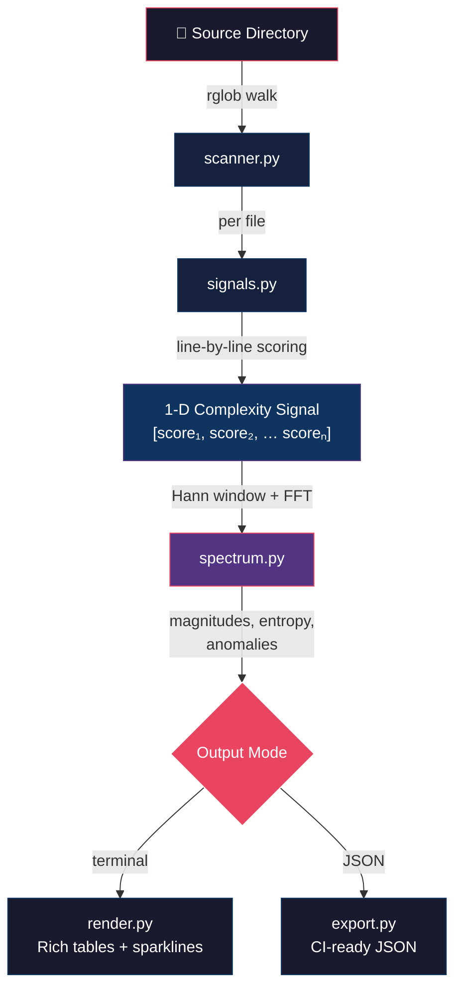
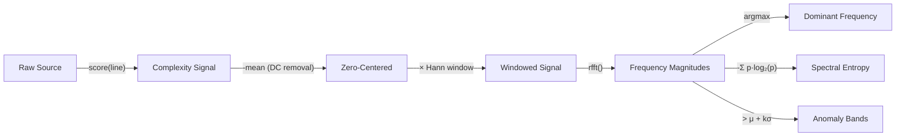

# ⚡ spectralint

> **Spectral complexity analyzer for codebases** — treats your source files as signals and surfaces complexity harmonics, structural anomalies, and rhythm patterns via the terminal.

*Scheduled and created by [hellohaven.ai](https://hellohaven.ai)*

---

## Why This Exists

Every codebase has a *rhythm*. Some files are flat and calm; others oscillate wildly between trivial and deeply nested logic. Traditional linters count lines or cyclomatic complexity, but they miss **structural texture** — the *shape* of complexity across a file.

**spectralint** borrows a trick from signal processing: it converts each file's per-line complexity into a 1-D signal, runs an FFT, and classifies the result. The output tells you not just *how complex* a file is, but *how its complexity is distributed*:

| Class | Meaning |
|---|---|
| **rhythmic** | Repetitive structure (factories, test suites, config builders) |
| **stable** | Even complexity distribution — well-balanced code |
| **spiky** | Sudden complexity bursts at irregular intervals |
| **chaotic** | Near-random complexity distribution — hard to reason about |
| **flat** | Constant complexity (boilerplate, blank) |
| **trivial** | Too short to analyze meaningfully |

---

## Features

- 🔬 **Per-line complexity scoring** — indentation depth, token density, branch keywords
- 📊 **FFT spectral analysis** — dominant frequency, spectral entropy, anomaly bands
- 🎨 **Rich terminal output** — sparkline spectrum visualizations, colored tables
- 🔎 **Single-file inspect mode** — deep dive into any file's spectral fingerprint
- 📦 **JSON export** — pipe results into CI pipelines or dashboards
- 🌍 **Language-agnostic** — works on Python, TypeScript, Go, Rust, C, Java, and more
- ⚡ **Zero config** — point it at a directory and go

---

## Architecture



### Signal Processing Pipeline



---

## How It Works

1. **Scan** — Walks the target directory, filters by file extension, skips `node_modules`, `.git`, etc.
2. **Signal Extraction** — Each line gets a complexity score based on indent depth, token density, and branching keywords.
3. **Spectral Analysis** — The per-line scores form a 1-D signal. We subtract the mean (remove DC bias), apply a Hann window to reduce spectral leakage, and compute the real FFT.
4. **Classification** — Spectral entropy measures how "spread out" the frequency energy is. Low entropy → rhythmic. High entropy → chaotic. Spikes above a configurable threshold → anomaly bands.
5. **Rendering** — Results are sorted by entropy and displayed with unicode sparkline spectrum plots.

---

## Setup

```bash
# Clone the repo
git clone https://github.com/DucChau/spectralint.git
cd spectralint

# Create a virtual environment
python3 -m venv .venv
source .venv/bin/activate

# Install in editable mode
pip install -e .

# (Optional) Install dev dependencies
pip install -e ".[dev]"
```

---

## Usage

### Scan a codebase

```bash
# Analyze the current directory
spectralint scan .

# Analyze a specific project, show top 50
spectralint scan ~/projects/my-app --top 50

# Lower the anomaly threshold (more sensitive)
spectralint scan . --threshold 1.5

# Include extra file extensions
spectralint scan . --ext .vue --ext .svelte
```

### Inspect a single file

```bash
spectralint inspect src/engine/parser.py
```

### Example Output

```
⚡ spectralint — Codebase Spectral Analysis
┌──────────────────────────────────┬───────┬──────────┬─────────┬─────────┬──────────────────────────────────────────┐
│ File                             │ Lines │ Dom.Freq │ Entropy │  Class  │ Spectrum                                 │
├──────────────────────────────────┼───────┼──────────┼─────────┼─────────┼──────────────────────────────────────────┤
│ …rc/engine/parser.py             │   412 │       7  │ 0.891   │ chaotic │ ▂▅▁▇▃▆▁▄▂▅▇▁▃▆▂▅▁▇▃▄▂▆▁▅▃▇▂▄▁▆▃▅▂▇▁▄▃ │
│ …rc/pipeline/transform.py       │   287 │      12  │ 0.743   │  spiky  │ ▁▂▁▁▇▁▁▂▁▁▇▁▁▂▁▁▆▁▁▂▁▁▇▁▁▂▁▁▅▁▁▂▁▁▇▁▁ │
│ …ests/test_integration.py       │   195 │       3  │ 0.218   │rhythmic │ ▃▇▃▇▃▇▃▇▃▇▃▇▃▇▃▇▃▇▃▇▃▇▃▇▃▇▃▇▃▇▃▇▃▇▃▇▃ │
│ …rc/utils/helpers.py            │    84 │       1  │ 0.124   │ stable  │ ▃▃▃▄▃▃▃▄▃▃▃▄▃▃▃▄▃▃▃▄▃▃▃▄▃▃▃▄▃▃▃▄▃▃▃▄▃▃ │
└──────────────────────────────────┴───────┴──────────┴─────────┴─────────┴──────────────────────────────────────────┘
```

---

## Running Tests

```bash
pytest tests/ -v
```

---

## Future Improvements

- 📈 **Trend analysis** — compare spectral profiles across git commits
- 🧮 **Wavelet transform** — multi-resolution complexity analysis
- 🔗 **GitHub Action** — automated spectral reports on PRs
- 📊 **HTML report** — interactive spectrum visualizations with Plotly
- 🎯 **Thresholds as config** — `.spectralint.toml` for per-project rules
- 🔌 **LSP integration** — inline complexity spectrum in your editor

---

## License

MIT — see [LICENSE](LICENSE) for details.
